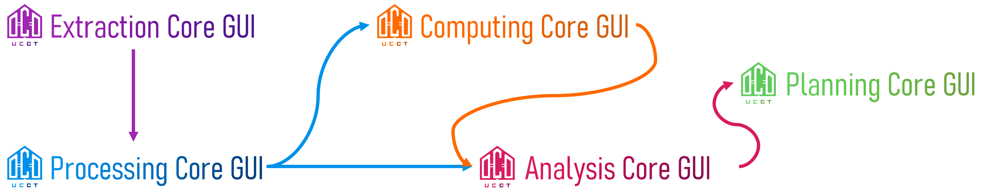

 
 <h2 align="center">UCDT Processing GUI</h2>
 
Automated Urban Building Spatial Data Integration and Export

    

## Info

本项目是 [UCDT Series 系列软件](https://ucdt-app.vercel.app/)中的一款产品。

本项目为 UCDT Processing GUI （城市建筑空间数据自动化聚合和导出）核心算法的图形（GUI）界面程序，为便于使用而进行开发的。

## UCDT Series

| Name                                                 | Description                                                  |
| ---------------------------------------------------- | ------------------------------------------------------------ |
|  | 🟣 Automated Urban Building Footprint Extraction 🟣 城市建筑轮廓自动提取 |
|  | 🔵 Automated Urban Building Spatial Data Integration and Export 🔵 城市建筑空间数据自动化聚合和导出 |
|   | 🟠 Urban Building Energy and Carbon Emission Computing 🟠 城市建筑能耗与碳排放计算 |
|    | 🔴 城市碳排放多尺度指标分析 🔴 Multi-Scale Urban Carbon Emission Indicator Analysis |
|    | 🟢 Decision Support for Low-Carbon Urban Planning and Design 🟢 低碳城市规划设计决策 |

## License

[GNU General Public License v3](https://github.com/buildingdata/ucdt-processing-gui/blob/main/LICENSE)
